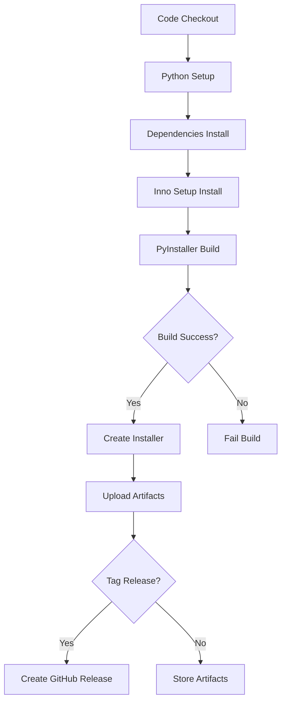

# GitHub Actions Workflows

Dieses Repository enthält automatisierte Build- und Release-Workflows für Star Wars Legion Tool Suite.

## 🔄 Verfügbare Workflows

### 1. Build and Release (`build-and-release.yml`)
**Automatischer Workflow** der ausgelöst wird bei:
- Push zu `main`/`master` Branch
- Erstellung von Tags (v1.0, v1.1, etc.)
- Pull Requests
- Manueller Trigger

**Funktionen:**
- ✅ Automatische PyInstaller Build-Erstellung
- ✅ Inno Setup Installer-Generierung  
- ✅ Artifact-Upload für Downloads
- ✅ Automatische GitHub Releases bei Tags
- ✅ Installer-Tests

### 2. Manual Build (`manual-build.yml`)
**Manueller Workflow** mit Optionen:
- 🎯 **Build-Typ auswählen**: Installer, Portable oder beides
- 🎯 **Draft Release erstellen**: Optional
- ✅ Flexible Build-Konfiguration

## 🚀 Verwendung

### Automatische Releases
1. Tag erstellen: `git tag v1.0.0`
2. Tag pushen: `git push origin v1.0.0`
3. GitHub Actions erstellt automatisch:
   - PyInstaller Build
   - Inno Setup Installer
   - GitHub Release mit Download-Links

### Manuelle Builds
1. Gehe zu **Actions** → **Manual Build**
2. Klicke **"Run workflow"**
3. Wähle Build-Optionen:
   - `installer`: Nur Windows-Installer (.exe)
   - `portable`: Nur Portable-ZIP
   - `both`: Beide Varianten
4. Optional: Draft Release erstellen

## 📦 Build-Ausgaben

### Installer (`SWLegion_Installer.exe`)
- Vollständiger Windows-Installer
- Automatische Deinstallation
- Start-Menü Integration
- Desktop-Verknüpfung (optional)

### Portable (`SWLegion_Portable.zip`)
- Keine Installation erforderlich
- Entpacken und ausführen
- `Start_SWLegion.bat` Launcher

## 🔧 Systemanforderungen

### GitHub Actions Runner:
- Windows Server 2022 (windows-latest)
- Python 3.11
- Inno Setup 6

### Build-Abhängigkeiten:
- PyInstaller
- PIL/Pillow
- tkinter
- Alle requirements.txt Pakete

## 📋 Workflow-Schritte

## 🔐 Sicherheit

### Ausgeschlossene Dateien:
- ❌ `gemini_key.txt` (API Keys)
- ❌ Persönliche Konfigurationsdateien
- ✅ Alle Spiel-Daten und Assets enthalten

### Berechtigungen:
- 📖 Repository lesen
- 📝 Releases erstellen
- 🔄 Artifacts uploaden

## 📊 Artifact-Aufbewahrung

| Typ | Aufbewahrung | Beschreibung |
|-----|--------------|--------------|
| Build Artifacts | 30 Tage | PyInstaller Output |
| Installer | 90 Tage | Windows .exe Installer |
| Releases | Permanent | Tagged Releases |

## 🐛 Troubleshooting

### Build fehlschlägt:
1. Prüfe Python-Dependencies in `requirements.txt`
2. Kontrolliere PyInstaller .spec Konfiguration
3. Überprüfe Inno Setup .iss Syntax

### Installer-Erstellung fehlschlägt:
1. Prüfe Build-Output in `dist/SWLegion/`
2. Kontrolliere .iss Pfade
3. Überprüfe Inno Setup Installation

### Release nicht erstellt:
1. Prüfe Tag-Format (`v*`)
2. Kontrolliere GitHub Token-Berechtigungen
3. Überprüfe Repository-Settings